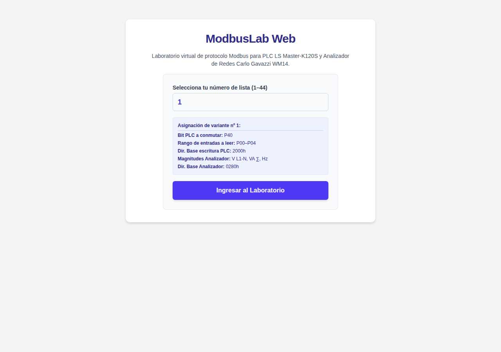
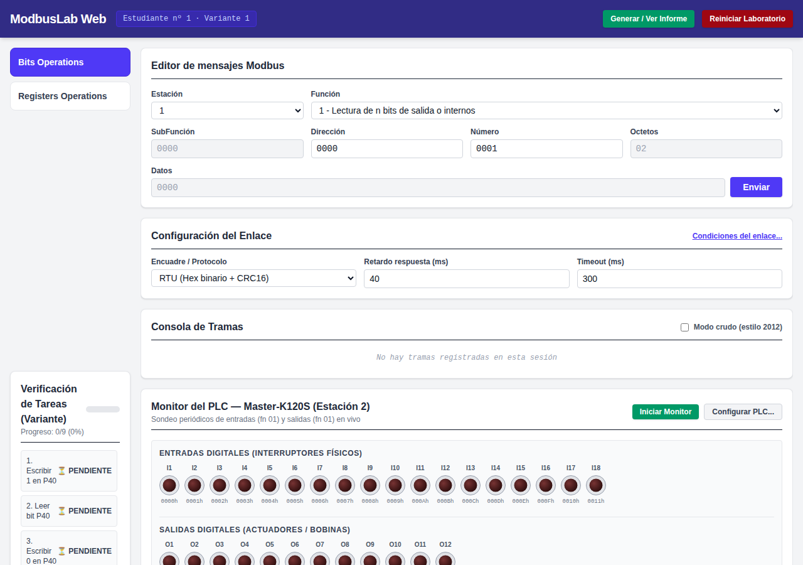
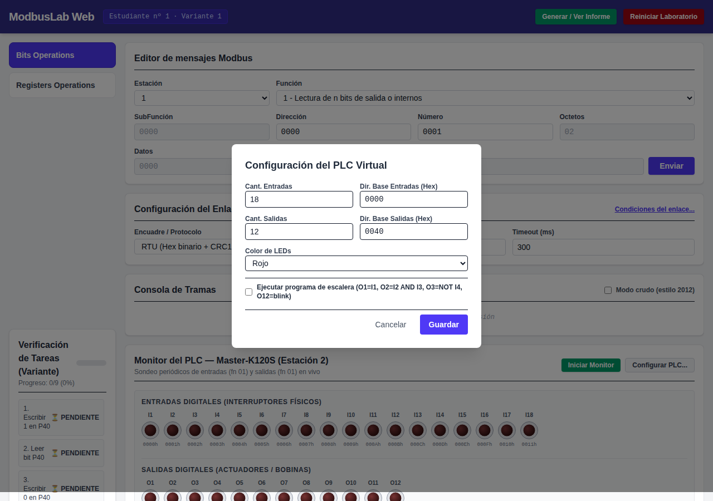
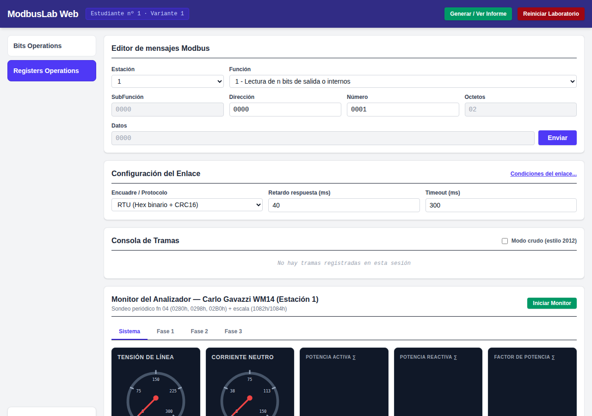
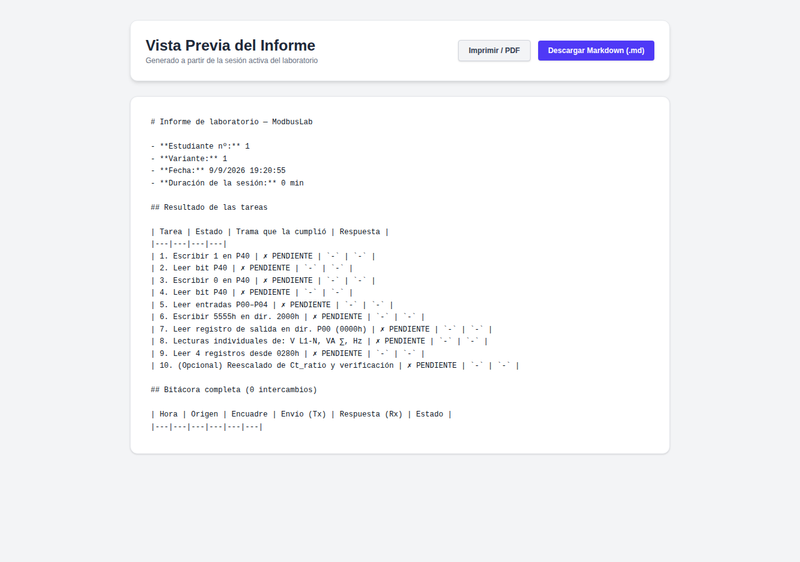

# Manual del Usuario de ModbusLab Web

Este manual proporciona una explicación detallada e ilustrada con capturas de pantalla sobre cómo utilizar cada componente de la interfaz de **ModbusLab Web**.

---

## 🏠 1. Selección de variante e Ingreso al Laboratorio

Al acceder a la aplicación por primera vez, se presenta la pantalla de bienvenida donde el estudiante debe ingresar su **Número de Lista (1 al 44)** asignado por el profesor.

### Pasos:
1. Ingrese su número de lista en el campo **Número de lista (1–44)**.
2. Haga clic en el botón **Ingresar al Laboratorio**.
3. El sistema cargará su variante e iniciará un sandbox aislado en su navegador.

---

## ⚡ 2. Panel de Operaciones con Bits (PLC Master-K120S)

En la pestaña **Bits Operations**, el estudiante interactúa con el **PLC Virtual Master-K120S (Estación 2)**.

### Secciones Principales:

1. **Barra Superior de Sesión:**
   - Muestra el número de estudiante y variante cargada.
   - Botón **Generar / Ver Informe** para ver el avance y reporte final.
   - Botón **Reiniciar Laboratorio** para reiniciar el sandbox local.

2. **Editor de Mensajes Modbus:**
   - Permite componer la PDU hexadecimal especificando **Estación**, **Función**, **SubFunción**, **Dirección**, **Número**, **Octetos** y **Datos**.
   - El botón **Enviar** transfiere la trama al bus virtual.

3. **Configuración del Enlace:**
   - Selector de encuadre/protocolo: **RTU (Hex binario + CRC16)**, **ASCII** o **TCP (MBAP)**.
   - Ajustes de **Retardo de respuesta (ms)** y **Timeout (ms)**.
   - Enlace a **Condiciones del enlace...** para inyección opcional de fallos (pérdida de tramas o ruido en CRC).

4. **Consola de Tramas:**
   - Registra de forma cronológica todas las tramas transmitidas ($\rightarrow$) y recibidas ($\leftarrow$).
   - Permite expandir cada fila para ver el desglose byte a byte o alternar al **Modo crudo**.

5. **Monitor del PLC — Master-K120S (Estación 2):**
   - **Entradas Digitales (I1–I18):** Interruptores virtuales accionables con el ratón.
   - **Salidas Digitales (O1–O12):** Actuadores gobernados por tramas Modbus o por el programa de escalera interno.
   - Botón **Iniciar Monitor:** Inicia el sondeo periódico de entradas y salidas (tramas Fn 01).
   - Botón **Configurar PLC...:** Abre el diálogo de configuración de E/S.

6. **Verificación de Tareas (Variante):**
   - Panel lateral que muestra en tiempo real el progreso de las 9 tareas obligatorias y su estado (**PENDIENTE** / **CUMPLIDA**).

---

## ⚙️ 3. Diálogo de Configuración del PLC

Al pulsar el botón **Configurar PLC...**, se despliega una ventana emergente para ajustar los parámetros de E/S del controlador:

### Opciones Configurables:
- **Cantidad de Entradas / Salidas:** Número de puntos digitales activos en el monitor.
- **Dirección Base de Entradas / Salidas:** Offset hexadecimal de memoria para los grupos de E/S (p. ej. `0000h` para entradas, `0040h` para salidas).
- **Color de LEDs:** Selección visual para los indicadores (Verde o Rojo).
- **Ejecutar Programa de Escalera:** Interruptor para habilitar o pausar la lógica interna de control del PLC.

---

## 📊 4. Panel de Operaciones con Registros (Analizador WM14)

En la pestaña **Registers Operations**, el estudiante interactúa con el **Analizador de Redes Carlo Gavazzi WM14 (Estación 1)**.

### Elementos Destacados:

1. **Tabs de Fase:**
   - Pestañas para seleccionar la vista: **Sistema** (valores trifásicos promedios y neutro), **Fase 1**, **Fase 2** y **Fase 3**.
2. **Instrumentos Analógicos de Aguja:**
   - Voltímetros y amperímetros con cuadrante de 270° que muestran la medición en tiempo real.
3. **Monitores Digitales LCD:**
   - Muestran lecturas numéricas de Potencia Activa ($\text{kW}$), Potencia Reactiva ($\text{kvar}$) y Factor de Potencia ($\text{pf}$).
4. **Banco de Cargas Trifásico (Inferior):**
   - Permite conectar/desconectar escalones de carga por fase para alterar la corriente y potencia medidas por el analizador.

---

## 📄 5. Generación y Previsualización del Informe Final

Al completar las tareas, al hacer clic en **Generar / Ver Informe** se abre la vista previa del reporte del laboratorio.

### Características del Informe:
- Encabezado con datos del estudiante, variante, fecha y duración de la sesión.
- Tabla de **Resultados de las Tareas** con la trama exacta que cumplió cada requisito.
- **Bitácora Completa** de todas las tramas transmitidas y recibidas.
- **Estado Final de Dispositivos** (mapa de memoria del PLC y mediciones del analizador).
- Botones para **Descargar en Markdown (`.md`)** o **Imprimir / Guardar en PDF**.
